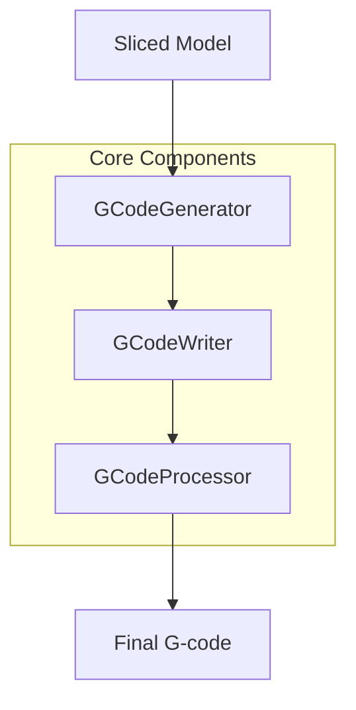

# Implementing a New G-code Flavor in PrusaSlicer

This document provides a step-by-step guide for implementing a new G-code flavor in PrusaSlicer. It outlines the key components, files, and changes needed to add support for a new machine-specific G-code dialect.

## Table of Contents
1. [Overview](#overview)
2. [G-code Generation Pipeline](#g-code-generation-pipeline)
3. [Key Components](#key-components)
4. [Implementation Steps](#implementation-steps)
5. [Testing and Validation](#testing-and-validation)

## Overview

The G-code generation system in PrusaSlicer is designed to be extensible, allowing for different G-code flavors to accommodate various machine controllers. The system consists of several key components that work together to generate machine-specific G-code.

## G-code Generation Pipeline



### Pipeline Flow
1. **Slicing**: Model is sliced into layers
2. **GCodeGenerator**: Handles high-level G-code generation strategy
3. **GCodeWriter**: Converts movements/operations to G-code syntax
4. **GCodeProcessor**: Post-processes and validates G-code
5. **Output**: Final G-code file is generated

## Key Components

### 1. GCodeFlavor Enum
Location: `src/libslic3r/PrintConfig.hpp`
```cpp
enum GCodeFlavor : unsigned char {
    gcfRepRapSprinter, gcfRepRapFirmware, gcfRepetier, gcfTeacup, gcfMakerWare, gcfMarlinLegacy, gcfMarlinFirmware, gcfKlipper, gcfSailfish, gcfMach3, gcfMachinekit,
    gcfSmoothie, gcfNoExtrusion, gcfAerotech
};
```

### 2. GCodeWriter Class
Location: `src/libslic3r/GCode/GCodeWriter.hpp`
Primary class responsible for G-code syntax generation.

Key Methods for Flavor Implementation:
- `preamble()`
M65     // Close shutter
G71     // Metric units (millimeters)
G76     // Time in seconds
G94     // Units per second mode
G90     // Absolute positioning
G109    // Disable velocity blending
G69     // Path blending with S curve
G16 X Y Z // Configure circular interpolation axes
G17     // Select XY plane for circular interpolation
- `postamble()`
- `set_temperature()`
- `set_fan()`
- `set_acceleration()`
- `travel_to_xyz()`
- `extrude_to_xyz()`

#### preamble() - Implemented in GCodeWriter.cpp [x]
Purpose: Generates the initial G-code commands that set up the printer's basic configuration
Functionality:
Sets units to millimeters (G21)
Sets absolute coordinates mode (G90)
Configures relative/absolute extrusion mode (M83/M82)
Resets extruder position
Flavor-specific behavior for different firmware types
#### postamble() - Implemented in GCodeWriter.cpp [x]
Purpose: Generates the final G-code commands to properly end the print
Functionality:
Adds end-of-program markers (e.g., M2 for Machinekit)
Cleanup commands specific to different firmware flavors
#### set_temperature() - Implemented in GCodeWriter.cpp [x]
Purpose: Generates G-code for setting and optionally waiting for temperature
Functionality:
Handles both regular (M104) and wait-for-temperature (M109) commands
Supports different syntax for various firmware (e.g., G10 for RepRapFirmware)
Handles multi-extruder configurations
Supports temperature synchronization (wait flag)
#### set_fan() - Implemented in GCodeWriter.cpp [x]
Purpose: Controls the cooling fan speed
Functionality:
Generates M106 (fan on) or M107 (fan off) commands
Handles different fan speed scales (0-255 vs 0-100)
Supports firmware-specific fan control syntax
Adds optional comments for clarity
#### set_acceleration()
Purpose: Modifies the printer's acceleration settings
Functionality:
Supports different acceleration types (print, travel)
Handles firmware-specific acceleration commands (M204)
Respects machine limits configuration
Supports separate travel acceleration for compatible firmware
#### travel_to_xyz()
Purpose: Generates movement commands without extrusion (travel moves)
Functionality:
Creates G0/G1 commands for non-extruding movement
Handles 3D movement (X, Y, Z coordinates)
Supports comments for move description
Updates internal position tracking
#### remove get_extrusion_axis() - implemented in PrintConfig.hpp [x]
Purpose: Returns the extrusion axis based on the selected G-code flavor
Functionality:
Checks the selected G-code flavor and returns the extrusion axis
for the current flavor remove extrusion axis
#### extrude_to_xyz() - 
Purpose: Generates movement commands with extrusion
Functionality:
Creates G1 commands for extruding movement
Calculates and includes extrusion amount (E axis)
Supports 3D movement with extrusion
Maintains position and extrusion tracking

### 2.2 GCodeFormatter Class
Location: `src/libslic3r/GCode/GCodeWriter.hpp`
Handles formatting and output of G-code commands.

Key Methods for Flavor Implementation:
#### handle comments - implemented in GCodeWritter.hpp [x]
Purpose: To ensure proper comment formatting in G-code output based on the G-code flavor being used. Different CNC controllers use different comment syntax:
Aerotech uses // (double forward slash)
Other flavors use ; (semicolon)
Changes Made:
Modified the GCodeFormatter class:
Added m_config member to access G-code flavor settings
Updated constructor to accept GCodeConfig reference
Modified emit_comment function to use different comment symbols based on flavor
Updated derived formatter classes:
Modified GCodeG1Formatter constructor to pass config
Modified GCodeG2G3Formatter constructor to pass config

#### handle the M64 and M65 commands - implemented in GCodeWritter.hpp [x]
Purpose: To ensure proper laser control commands in G-code output based on the G-code flavor being used. Different CNC controllers use different commands:
Aerotech uses M64 (laser on) and M65 (laser off)
Other flavors use 10 (disable extruder) and 11 (enable extruder)
Changes Made:
Modified the GCodeWriter class:
Added m_config member to access G-code flavor settings
Updated constructor to accept GCodeConfig reference
Modified the GCodeFormatter class:
Added m_config member to access G-code flavor settings
Updated constructor to accept GCodeConfig reference
Modified the GCodeG1Formatter class:
Added m_config member to access G-code flavor settings
Updated constructor to accept GCodeConfig reference
Modified the GCodeG2G3Formatter class:
Added m_config member to access G-code flavor settings
Updated constructor to accept GCodeConfig reference

### 3. GCodeProcessor Class
Location: `src/libslic3r/GCode/GCodeProcessor.hpp`
Handles G-code parsing and processing.

## Implementation Steps

### 1. Add New Flavor Enum
```cpp
// In PrintConfig.hpp
enum GCodeFlavor : unsigned char {
    // ... existing flavors ...
    gcfAerotech,
};
```

### 2. Update Configuration
Files to modify:
- `src/libslic3r/PrintConfig.hpp`
- `src/libslic3r/PrintConfig.cpp`

Add the new flavor to the configuration options.

### 3. Implement Flavor-Specific Behavior
In `GCodeWriter.cpp`, modify the following methods to handle your flavor:

```cpp
void GCodeWriter::apply_print_config(const PrintConfig &print_config) {
    // Add flavor-specific initialization
}

std::string GCodeWriter::preamble() {
    // Add flavor-specific preamble
}

std::string GCodeWriter::postamble() {
    // Add flavor-specific postamble
}

std::string GCodeWriter::set_temperature(unsigned int temperature, bool wait) {
    // Add flavor-specific temperature command
}
```

### 4. Command Mapping Table

| Standard Command | Description | Implementation Location | Notes |
|-----------------|-------------|------------------------|--------|
| G0/G1 | Linear Move | `GCodeWriter::travel_to_xyz()` | Check if flavor needs special parameters |
| G2/G3 | Arc Move | `GCodeWriter::arc_move()` | Optional for basic implementation |
| M104/M109 | Set Temperature | `GCodeWriter::set_temperature()` | Check parameter format (S vs P) |
| M106/M107 | Fan Control | `GCodeWriter::set_fan()` | Check parameter format |
| M204 | Set Acceleration | `GCodeWriter::set_acceleration()` | Check if flavor supports it |

### 5. Required Changes Checklist

- [x] Add flavor enum
- [ ] Update configuration files
- [ ] Implement basic movement commands
- [ ] Implement temperature control
- [ ] Implement fan control
- [ ] Implement acceleration control
- [ ] Add preamble/postamble
- [ ] Update documentation
- [ ] Add test cases

## Testing and Validation

1. **Unit Tests**
   - Add tests for new flavor in `tests/libslic3r/test_gcode.cpp`
   - Test basic movement generation
   - Test temperature commands
   - Test special features

2. **Integration Tests**
   - Test with actual printer/controller
   - Verify command syntax
   - Check parameter formatting
   - Validate special features

3. **Validation Checklist**
   - [ ] Basic movements work correctly
   - [ ] Temperature commands are formatted properly
   - [ ] Fan control works as expected
   - [ ] Acceleration control is correct
   - [ ] Special features are implemented
   - [ ] Documentation is complete
   - [ ] Tests pass

## Example Implementation

Here's a minimal example of implementing a new flavor:

```cpp
// In GCodeWriter.cpp

std::string GCodeWriter::set_temperature(unsigned int temperature, bool wait) {
    if (FLAVOR_IS(gcfAerotech)) {
        // Implement flavor-specific temperature command
        std::ostringstream gcode;
        gcode << "M104 P" << temperature;
        if (wait)
            gcode << " W";
        return gcode.str();
    }
    // ... rest of the implementation
}
```

## References

- GCodeWriter Documentation
- Machine-specific G-code documentation
- Existing flavor implementations (Marlin, RepRap, etc.)

## GCodeWriter.cpp Function Reference

| Function Name                         | Description                                                        | Aerotech Implementation                                                                                                                                                                |
|---------------------------------------|--------------------------------------------------------------------|---------------------------------------------------------------------------------------------------------------------------------------------------------------------------------------|
| supports_separate_travel_acceleration | Static function to check if a G-code flavor supports travel accel  | No specific changes                                                                                                                                                                    |
| apply_print_config                    | Applies print configuration settings to the writer                 | No specific changes                                                                                                                                                                    |
| set_extruders                         | Configures the extruders to be used                                | No specific changes                                                                                                                                                                    |
| preamble                              | Generates G-code preamble (start of file commands)                 | Added:<br>• M65 (close shutter)<br>• G71 (metric)<br>• G76 (time in seconds)<br>• G94 (units/sec)<br>• G90 (absolute)<br>• G69 (S-curve accel)<br>• G109 (disable velocity blending)<br>• G16 X Y Z (set axes)<br>• G17 (XY plane) |
| postamble                             | Generates G-code postamble (end of file commands)                  | Added:<br>• M65 (close shutter)<br>• G1 Z15 F1000 (safe Z)<br>• M2 (program end)                                                                                                      |
| set_temperature                       | Sets extruder temperature with optional wait                       | Disabled for Aerotech (laser system)                                                                                                                                                   |
| set_bed_temperature                   | Sets bed temperature with optional wait                            | No specific changes                                                                                                                                                                    |
| set_chamber_temperature               | Sets chamber temperature with optional wait                        | No specific changes                                                                                                                                                                    |
| set_acceleration_internal             | Sets acceleration for different movement types                     | No specific changes                                                                                                                                                                    |
| reset_e                               | Resets the extruder position                                       | No specific changes                                                                                                                                                                    |
| update_progress                       | Updates print progress information                                 | No specific changes                                                                                                                                                                    |
| toolchange_prefix                     | Generates prefix for tool change commands                          | No specific changes                                                                                                                                                                    |
| toolchange                            | Generates tool change commands                                     | No specific changes                                                                                                                                                                    |
| set_speed                             | Sets movement speed                                                | No specific changes                                                                                                                                                                    |
| get_travel_to_xy_gcode                | Generates G-code for XY travel moves                               | No specific changes                                                                                                                                                                    |
| travel_to_xy                          | Executes XY travel moves                                           | No specific changes                                                                                                                                                                    |
| travel_to_xy_G2G3IJ                   | Executes circular XY travel moves                                  | No specific changes                                                                                                                                                                    |
| travel_to_xyz                         | Executes XYZ travel moves                                          | No specific changes                                                                                                                                                                    |
| get_travel_to_xyz_gcode               | Generates G-code for XYZ travel moves                              | No specific changes                                                                                                                                                                    |
| travel_to_z                           | Executes Z travel moves                                            | No specific changes                                                                                                                                                                    |
| get_travel_to_z_gcode                 | Generates G-code for Z travel moves                                | No specific changes                                                                                                                                                                    |
| extrude_to_xy                         | Executes XY moves with extrusion                                   | Modified to skip extrusion axis for Aerotech                                                                                                                                           |
| extrude_to_xyz                        | Executes XYZ moves with extrusion                                  | Modified to skip extrusion axis for Aerotech                                                                                                                                           |
| extrude_to_xy_G2G3IJ                  | Executes circular XY moves with extrusion                          | Modified to skip extrusion axis for Aerotech                                                                                                                                           |
| retract                               | Executes filament retraction                                       | Uses M65 (close shutter) for Aerotech                                                                                                                                                  |
| retract_for_toolchange                | Executes filament retraction for tool changes                      | Uses M65 (close shutter) for Aerotech                                                                                                                                                  |
| _retract                              | Internal retraction implementation                                 | Modified to output M65 (close shutter) for Aerotech                                                                                                                                    |
| unretract                             | Executes filament unretraction                                     | Modified to output M64 (open shutter) for Aerotech                                                                                                                                     |
| update_position                       | Updates current position                                           | No specific changes                                                                                                                                                                    |
| set_fan                               | Sets fan speed                                                     | No specific changes                                                                                                                                                                    |
| emit_axis                             | Formats and emits axis movements                                   | No specific changes                                                                                                                                                                    |
