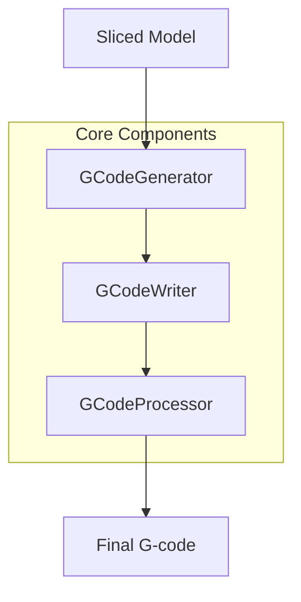

# Implementing a New G-code Flavor in PrusaSlicer

This document provides a step-by-step guide for implementing a new G-code flavor in PrusaSlicer. It outlines the key components, files, and changes needed to add support for a new machine-specific G-code dialect.

## Table of Contents
1. [Overview](#overview)
2. [G-code Generation Pipeline](#g-code-generation-pipeline)
3. [Key Components](#key-components)
4. [Implementation Steps](#implementation-steps)
5. [Testing and Validation](#testing-and-validation)

## Overview

The G-code generation system in PrusaSlicer is designed to be extensible, allowing for different G-code flavors to accommodate various machine controllers. The system consists of several key components that work together to generate machine-specific G-code.

## G-code Generation Pipeline



### Pipeline Flow
1. **Slicing**: Model is sliced into layers
2. **GCodeGenerator**: Handles high-level G-code generation strategy
3. **GCodeWriter**: Converts movements/operations to G-code syntax
4. **GCodeProcessor**: Post-processes and validates G-code
5. **Output**: Final G-code file is generated

## Key Components

### 1. GCodeFlavor Enum
Location: `src/libslic3r/PrintConfig.hpp`
```cpp
enum GCodeFlavor : unsigned char {
    gcfRepRapSprinter, gcfRepRapFirmware, gcfRepetier, gcfTeacup, gcfMakerWare, gcfMarlinLegacy, gcfMarlinFirmware, gcfKlipper, gcfSailfish, gcfMach3, gcfMachinekit,
    gcfSmoothie, gcfNoExtrusion, gcfAerotech
};
```

### 2. GCodeWriter Class
Location: `src/libslic3r/GCode/GCodeWriter.hpp`
Primary class responsible for G-code syntax generation.

Key Methods for Flavor Implementation:
- `preamble()`
M65     // Close shutter
G71     // Metric units (millimeters)
G76     // Time in seconds
G94     // Units per second mode
G90     // Absolute positioning
G109    // Disable velocity blending
G69     // Path blending with S curve
G16 X Y Z // Configure circular interpolation axes
G17     // Select XY plane for circular interpolation
- `postamble()`
- `set_temperature()`
- `set_fan()`
- `set_acceleration()`
- `travel_to_xyz()`
- `extrude_to_xyz()`

#### preamble() - Implemented in GCodeWriter.cpp [x]
Purpose: Generates the initial G-code commands that set up the printer's basic configuration
Functionality:
Sets units to millimeters (G21)
Sets absolute coordinates mode (G90)
Configures relative/absolute extrusion mode (M83/M82)
Resets extruder position
Flavor-specific behavior for different firmware types
#### postamble() - Implemented in GCodeWriter.cpp [x]
Purpose: Generates the final G-code commands to properly end the print
Functionality:
Adds end-of-program markers (e.g., M2 for Machinekit)
Cleanup commands specific to different firmware flavors
#### set_temperature() - Implemented in GCodeWriter.cpp [x]
Purpose: Generates G-code for setting and optionally waiting for temperature
Functionality:
Handles both regular (M104) and wait-for-temperature (M109) commands
Supports different syntax for various firmware (e.g., G10 for RepRapFirmware)
Handles multi-extruder configurations
Supports temperature synchronization (wait flag)
#### set_fan() - Implemented in GCodeWriter.cpp [x]
Purpose: Controls the cooling fan speed
Functionality:
Generates M106 (fan on) or M107 (fan off) commands
Handles different fan speed scales (0-255 vs 0-100)
Supports firmware-specific fan control syntax
Adds optional comments for clarity
#### set_acceleration()
Purpose: Modifies the printer's acceleration settings
Functionality:
Supports different acceleration types (print, travel)
Handles firmware-specific acceleration commands (M204)
Respects machine limits configuration
Supports separate travel acceleration for compatible firmware
#### travel_to_xyz()
Purpose: Generates movement commands without extrusion (travel moves)
Functionality:
Creates G0/G1 commands for non-extruding movement
Handles 3D movement (X, Y, Z coordinates)
Supports comments for move description
Updates internal position tracking
#### remove get_extrusion_axis() - implemented in PrintConfig.hpp [x]
Purpose: Returns the extrusion axis based on the selected G-code flavor
Functionality:
Checks the selected G-code flavor and returns the extrusion axis
for the current flavor remove extrusion axis
#### extrude_to_xyz() - 
Purpose: Generates movement commands with extrusion
Functionality:
Creates G1 commands for extruding movement
Calculates and includes extrusion amount (E axis)
Supports 3D movement with extrusion
Maintains position and extrusion tracking

### 2.2 GCodeFormatter Class
Location: `src/libslic3r/GCode/GCodeWriter.hpp`
Handles formatting and output of G-code commands.

Key Methods for Flavor Implementation:
#### handle comments - implemented in GCodeWritter.hpp [x]
Purpose: To ensure proper comment formatting in G-code output based on the G-code flavor being used. Different CNC controllers use different comment syntax:
Aerotech uses // (double forward slash)
Other flavors use ; (semicolon)
Changes Made:
Modified the GCodeFormatter class:
Added m_config member to access G-code flavor settings
Updated constructor to accept GCodeConfig reference
Modified emit_comment function to use different comment symbols based on flavor
Updated derived formatter classes:
Modified GCodeG1Formatter constructor to pass config
Modified GCodeG2G3Formatter constructor to pass config

#### handle the M64 and M65 commands - implemented in GCodeWritter.hpp [x]
Purpose: To ensure proper laser control commands in G-code output based on the G-code flavor being used. Different CNC controllers use different commands:
Aerotech uses M64 (laser on) and M65 (laser off)
Other flavors use 10 (disable extruder) and 11 (enable extruder)
Changes Made:
Modified the GCodeWriter class:
Added m_config member to access G-code flavor settings
Updated constructor to accept GCodeConfig reference
Modified the GCodeFormatter class:
Added m_config member to access G-code flavor settings
Updated constructor to accept GCodeConfig reference
Modified the GCodeG1Formatter class:
Added m_config member to access G-code flavor settings
Updated constructor to accept GCodeConfig reference
Modified the GCodeG2G3Formatter class:
Added m_config member to access G-code flavor settings
Updated constructor to accept GCodeConfig reference

### 3. GCodeProcessor Class
Location: `src/libslic3r/GCode/GCodeProcessor.hpp`
Handles G-code parsing and processing.

## Implementation Steps

### 1. Add New Flavor Enum
```cpp
// In PrintConfig.hpp
enum GCodeFlavor : unsigned char {
    // ... existing flavors ...
    gcfAerotech,
};
```

### 2. Update Configuration
Files to modify:
- `src/libslic3r/PrintConfig.hpp`
- `src/libslic3r/PrintConfig.cpp`

Add the new flavor to the configuration options.

### 3. Implement Flavor-Specific Behavior
In `GCodeWriter.cpp`, modify the following methods to handle your flavor:

```cpp
void GCodeWriter::apply_print_config(const PrintConfig &print_config) {
    // Add flavor-specific initialization
}

std::string GCodeWriter::preamble() {
    // Add flavor-specific preamble
}

std::string GCodeWriter::postamble() {
    // Add flavor-specific postamble
}

std::string GCodeWriter::set_temperature(unsigned int temperature, bool wait) {
    // Add flavor-specific temperature command
}
```

### 4. Command Mapping Table

| Standard Command | Description | Implementation Location | Notes |
|-----------------|-------------|------------------------|--------|
| G0/G1 | Linear Move | `GCodeWriter::travel_to_xyz()` | Check if flavor needs special parameters |
| G2/G3 | Arc Move | `GCodeWriter::arc_move()` | Optional for basic implementation |
| M104/M109 | Set Temperature | `GCodeWriter::set_temperature()` | Check parameter format (S vs P) |
| M106/M107 | Fan Control | `GCodeWriter::set_fan()` | Check parameter format |
| M204 | Set Acceleration | `GCodeWriter::set_acceleration()` | Check if flavor supports it |

### 5. Required Changes Checklist

- [x] Add flavor enum
- [ ] Update configuration files
- [ ] Implement basic movement commands
- [ ] Implement temperature control
- [ ] Implement fan control
- [ ] Implement acceleration control
- [ ] Add preamble/postamble
- [ ] Update documentation
- [ ] Add test cases

## Testing and Validation

1. **Unit Tests**
   - Add tests for new flavor in `tests/libslic3r/test_gcode.cpp`
   - Test basic movement generation
   - Test temperature commands
   - Test special features

2. **Integration Tests**
   - Test with actual printer/controller
   - Verify command syntax
   - Check parameter formatting
   - Validate special features

3. **Validation Checklist**
   - [ ] Basic movements work correctly
   - [ ] Temperature commands are formatted properly
   - [ ] Fan control works as expected
   - [ ] Acceleration control is correct
   - [ ] Special features are implemented
   - [ ] Documentation is complete
   - [ ] Tests pass

## Example Implementation

Here's a minimal example of implementing a new flavor:

```cpp
// In GCodeWriter.cpp

std::string GCodeWriter::set_temperature(unsigned int temperature, bool wait) {
    if (FLAVOR_IS(gcfAerotech)) {
        // Implement flavor-specific temperature command
        std::ostringstream gcode;
        gcode << "M104 P" << temperature;
        if (wait)
            gcode << " W";
        return gcode.str();
    }
    // ... rest of the implementation
}
```

## References

- GCodeWriter Documentation
- Machine-specific G-code documentation
- Existing flavor implementations (Marlin, RepRap, etc.)

## GCodeWriter.cpp Function Reference

| Function Name                         | Description                                                        | Aerotech Implementation                                                                                                                                                                |
|---------------------------------------|--------------------------------------------------------------------|---------------------------------------------------------------------------------------------------------------------------------------------------------------------------------------|
| supports_separate_travel_acceleration | Static function to check if a G-code flavor supports travel accel  | No specific changes                                                                                                                                                                    |
| apply_print_config                    | Applies print configuration settings to the writer                 | No specific changes                                                                                                                                                                    |
| set_extruders                         | Configures the extruders to be used                                | No specific changes                                                                                                                                                                    |
| preamble                              | Generates G-code preamble (start of file commands)                 | Added:<br>• M65 (close shutter)<br>• G71 (metric)<br>• G76 (time in seconds)<br>• G94 (units/sec)<br>• G90 (absolute)<br>• G69 (S-curve accel)<br>• G109 (disable velocity blending)<br>• G16 X Y Z (set axes)<br>• G17 (XY plane) |
| postamble                             | Generates G-code postamble (end of file commands)                  | Added:<br>• M65 (close shutter)<br>• G1 Z15 F1000 (safe Z)<br>• M2 (program end)                                                                                                      |
| set_temperature                       | Sets extruder temperature with optional wait                       | Disabled for Aerotech (laser system)                                                                                                                                                   |
| set_bed_temperature                   | Sets bed temperature with optional wait                            | No specific changes                                                                                                                                                                    |
| set_chamber_temperature               | Sets chamber temperature with optional wait                        | No specific changes                                                                                                                                                                    |
| set_acceleration_internal             | Sets acceleration for different movement types                     | No specific changes                                                                                                                                                                    |
| reset_e                               | Resets the extruder position                                       | No specific changes                                                                                                                                                                    |
| update_progress                       | Updates print progress information                                 | No specific changes                                                                                                                                                                    |
| toolchange_prefix                     | Generates prefix for tool change commands                          | No specific changes                                                                                                                                                                    |
| toolchange                            | Generates tool change commands                                     | No specific changes                                                                                                                                                                    |
| set_speed                             | Sets movement speed                                                | No specific changes                                                                                                                                                                    |
| get_travel_to_xy_gcode                | Generates G-code for XY travel moves                               | No specific changes                                                                                                                                                                    |
| travel_to_xy                          | Executes XY travel moves                                           | No specific changes                                                                                                                                                                    |
| travel_to_xy_G2G3IJ                   | Executes circular XY travel moves                                  | No specific changes                                                                                                                                                                    |
| travel_to_xyz                         | Executes XYZ travel moves                                          | No specific changes                                                                                                                                                                    |
| get_travel_to_xyz_gcode               | Generates G-code for XYZ travel moves                              | No specific changes                                                                                                                                                                    |
| travel_to_z                           | Executes Z travel moves                                            | No specific changes                                                                                                                                                                    |
| get_travel_to_z_gcode                 | Generates G-code for Z travel moves                                | No specific changes                                                                                                                                                                    |
| extrude_to_xy                         | Executes XY moves with extrusion                                   | Modified to skip extrusion axis for Aerotech                                                                                                                                           |
| extrude_to_xyz                        | Executes XYZ moves with extrusion                                  | Modified to skip extrusion axis for Aerotech                                                                                                                                           |
| extrude_to_xy_G2G3IJ                  | Executes circular XY moves with extrusion                          | Modified to skip extrusion axis for Aerotech                                                                                                                                           |
| retract                               | Executes filament retraction                                       | Uses M65 (close shutter) for Aerotech                                                                                                                                                  |
| retract_for_toolchange                | Executes filament retraction for tool changes                      | Uses M65 (close shutter) for Aerotech                                                                                                                                                  |
| _retract                              | Internal retraction implementation                                 | Modified to output M65 (close shutter) for Aerotech                                                                                                                                    |
| unretract                             | Executes filament unretraction                                     | Modified to output M64 (open shutter) for Aerotech                                                                                                                                     |
| update_position                       | Updates current position                                           | No specific changes                                                                                                                                                                    |
| set_fan                               | Sets fan speed                                                     | No specific changes                                                                                                                                                                    |
| emit_axis                             | Formats and emits axis movements                                   | No specific changes                                                                                                                                                                    |

## Default values in Print configuration

| Setting | Default Value | Description |
|---------|--------------|-------------|
| gcode_resolution | 0.001 | Minimum resolution for G-code output (in mm). For Aerotech, set to 0.001 for 1um resolution |
| max_print_speed | 80-200 | Maximum speed for print moves (in mm/s) |
| external_perimeter_speed | 50% | Speed for external perimeters as percentage of perimeter speed |
| first_layer_speed | 30 | Speed for printing first layer (in mm/s) |
| support_material_speed | 60 | Speed for printing support material (in mm/s) |
| infill_speed | 80 | Speed for printing infill (in mm/s) |
| bridge_speed | 60 | Speed for printing bridges (in mm/s) |
| gap_fill_speed | 20 | Speed for filling small gaps |
| travel_speed | 130 | Speed for non-printing moves (in mm/s) |
| small_perimeter_speed | 15 | Speed for small perimeters (in mm/s) |
| max_volumetric_speed | 0 | Maximum volumetric speed (in mm³/s). 0 means no limit |
| filament_minimal_purge_on_wipe_tower | 15 mm³ | Minimum amount of material to purge on the wipe tower after a tool change to ensure reliable extrusion |
| filament_cooling_final_speed | 3.4 mm/s | Final speed for cooling moves on the wipe tower |
| filament_purge_multiplier | 100% | Multiplier for purge volume on the wipe tower |
| filament_load_time | 0s | Time for loading filament during tool changes |
| filament_unload_time | 0s | Time for unloading filament during tool changes |
| filament_multitool_ramming | false | Increase extruder current during filament swaps |
| filament_multitool_ramming_volume | 10 mm³ | Volume to be rammed before toolchange |
| filament_multitool_ramming_flow | 10 mm³/s | Flow rate used for ramming |
| filament_diameter | 1.75 mm | Filament diameter for calculating extrusion |
| filament_type | "PLA" | Material type for use in custom G-codes |
| filament_soluble | false | Indicates if material is soluble (for support) |
| filament_abrasive | false | Indicates if material requires hardened nozzle |
| filament_shrinkage_compensation_xy | 0% | XY scaling to compensate for material shrinkage |
| filament_shrinkage_compensation_z | 0% | Z scaling to compensate for material shrinkage |
| fill_angle | 45° | Base angle for infill orientation |
| fill_density | varies | Density of internal infill (0-100%) |
| fill_pattern | "stars" | Fill pattern for general low-density infill (options: rectilinear, grid, triangles, stars, cubic, line, concentric, honeycomb, 3dhoneycomb, gyroid, hilbertcurve, archimedeanchords, octagramspiral, adaptivecubic, supportcubic, lightning, zigzag) |
| first_layer_acceleration | 0 mm/s² | Acceleration for first layer. Zero disables acceleration control |
| first_layer_acceleration_over_raft | 0 mm/s² | Acceleration for first object layer over raft interface |
| first_layer_bed_temperature | 0°C | Heated build plate temperature for first layer |
| first_layer_extrusion_width | 200% | Manual extrusion width for first layer |
| first_layer_height | 0.35 mm | Height of the first layer |
| first_layer_speed | 30 mm/s | Speed for all first layer print moves |
| first_layer_speed_over_raft | 30 mm/s | Speed for first object layer over raft interface |
| first_layer_temperature | 200°C | Nozzle temperature for first layer |
| full_fan_speed_layer | 0 | Layer number where fan reaches full speed |
| fuzzy_skin | "none" | Fuzzy skin type (none, external, all) |
| fuzzy_skin_thickness | 0.3 mm | Maximum offset distance for fuzzy skin points |
| fuzzy_skin_point_dist | 0.8 mm | Distance between fuzzy skin points |
| gap_fill_enabled | true | Enable filling of gaps between perimeters |
| gap_fill_speed | 20 mm/s | Speed for filling small gaps |
| gcode_comments | false | Enable verbose G-code comments |
| gcode_flavor | "reprap" | G-code flavor (reprap, reprapfirmware, repetier, teacup, makerware, marlin, marlin2, klipper, sailfish, mach3, machinekit, smoothie, no-extrusion) |
| gcode_label_objects | "disabled" | Label objects in G-code (disabled, octoprint, firmware) |
| high_current_on_filament_swap | false | Increase extruder current during filament swaps |
| infill_acceleration | 0 mm/s² | Acceleration for infill moves |
| solid_infill_acceleration | 0 mm/s² | Acceleration for solid infill moves |
| top_solid_infill_acceleration | 0 mm/s² | Acceleration for top solid infill moves |
| wipe_tower_acceleration | 0 mm/s² | Acceleration for wipe tower moves |
| travel_acceleration | 0 mm/s² | Acceleration for travel moves |
| infill_every_layers | 1 | Combine infill every n layers |
| infill_anchor | 600% | Length of infill anchor to perimeter |
| infill_anchor_max | 50 mm | Maximum length of infill anchor |
| infill_extruder | 1 | Extruder to use for infill |
| infill_extrusion_width | 0 | Manual extrusion width for infill |
| interface_shells | false | Generate solid shells between adjacent materials |
| mmu_segmented_region_max_width | 0 mm | Maximum width of a segmented region |
| mmu_segmented_region_interlocking_depth | 0 mm | Interlocking depth of a segmented region |
| ironing | false | Enable ironing of top layers |
| ironing_type | "top" | Ironing type (top, topmost, solid) |
| ironing_flowrate | 15% | Flow rate for ironing relative to layer height |
| ironing_spacing | 0.1 mm | Distance between ironing lines |
| ironing_speed | 15 mm/s | Speed for ironing |
| layer_gcode | "" | G-code to run after layer change |
| remaining_times | false | Emit M73 remaining time commands |
| silent_mode | true | Support for stealth mode |
| binary_gcode | false | Support for binary G-code format |
| machine_limits_usage | "time_estimate_only" | How to apply machine limits |
| machine_max_feedrate_x | [500, 200] mm/s | Maximum X feedrate |
| machine_max_feedrate_y | [500, 200] mm/s | Maximum Y feedrate |
| machine_max_feedrate_z | [12, 12] mm/s | Maximum Z feedrate |
| machine_max_feedrate_e | [120, 120] mm/s | Maximum E feedrate |
| machine_max_acceleration_x | [9000, 1000] mm/s² | Maximum X acceleration |
| machine_max_acceleration_y | [9000, 1000] mm/s² | Maximum Y acceleration |
| machine_max_acceleration_z | [500, 200] mm/s² | Maximum Z acceleration |
| machine_max_acceleration_e | [10000, 5000] mm/s² | Maximum E acceleration |
| machine_max_jerk_x | [10, 10] mm/s | Maximum X jerk |
| machine_max_jerk_y | [10, 10] mm/s | Maximum Y jerk |
| machine_max_jerk_z | [0.2, 0.4] mm/s | Maximum Z jerk |
| machine_max_jerk_e | [2.5, 2.5] mm/s | Maximum E jerk |
| machine_min_extruding_rate | [0, 0] mm/s | Minimum feedrate when extruding |
| machine_min_travel_rate | [0, 0] mm/s | Minimum travel feedrate |
| machine_max_acceleration_extruding | [1500, 1250] mm/s² | Maximum acceleration when extruding |
| machine_max_acceleration_retracting | [1500, 1250] mm/s² | Maximum acceleration when retracting |
| machine_max_acceleration_travel | [1500, 1250] mm/s² | Maximum acceleration for travel moves |
| max_fan_speed | 100% | Maximum fan speed |
| max_layer_height | 0 mm | Maximum printable layer height |
| max_print_speed | 80 mm/s | Maximum print speed |
| max_volumetric_speed | 0 mm³/s | Maximum volumetric extrusion rate |
| max_volumetric_extrusion_rate_slope_positive | 0 mm³/s² | Maximum volumetric slope for speed increase |
| max_volumetric_extrusion_rate_slope_negative | 0 mm³/s² | Maximum volumetric slope for speed decrease |
| min_fan_speed | 35% | Minimum fan speed |
| min_layer_height | 0.07 mm | Minimum printable layer height |
| min_print_speed | 10 mm/s | Minimum print speed |
| min_skirt_length | 0 mm | Minimum skirt extrusion length |
| notes | "" | Configuration notes |
| nozzle_diameter | 0.4 mm | Nozzle diameter |
| host_type | "prusalink" | Printer host type (prusalink, prusaconnect, octoprint, moonraker, duet, flashair, astrobox, repetier, mks) |
| only_retract_when_crossing_perimeters | false | Only retract when crossing perimeters |
| ooze_prevention | false | Enable ooze prevention |
| output_filename_format | "[input_filename_base].gcode" | Output filename format |
| overhangs | true | Detect bridging perimeters |
| parking_pos_retraction | 92 mm | Filament parking position |
| extra_loading_move | -2 mm | Extra loading distance |
| multimaterial_purging | 140 mm³ | Purging volume |
| perimeter_acceleration | 0 mm/s² | Acceleration for perimeters |
| external_perimeter_acceleration | 0 mm/s² | Acceleration for external perimeters |
| perimeter_extruder | 1 | Extruder to use for perimeters |
| perimeter_extrusion_width | 0 | Manual extrusion width for perimeters |
| perimeter_speed | 60 mm/s | Speed for perimeters |
| perimeters | 3 | Number of perimeter loops |
| post_process | [] | Post-processing scripts |
| printer_model | "" | Printer type |
| printer_notes | "" | Printer notes |
| printer_vendor | "" | Printer vendor |
| printer_variant | "" | Printer variant |
| raft_contact_distance | 0.1 mm | Raft contact Z distance |
| raft_expansion | 1.5 mm | Raft expansion |
| raft_first_layer_density | 90% | First raft layer density |
| raft_first_layer_expansion | 3 mm | First raft layer expansion |
| raft_layers | 0 | Number of raft layers |
| resolution | 0 mm | Slice resolution |
| gcode_resolution | 0.0125 mm | G-code resolution |
| retract_before_travel | 2 mm | Minimum travel after retraction |
| retract_before_wipe | 0% | Retract amount before wipe |
| retract_layer_change | false | Retract on layer change |
| retract_length | 2 mm | Retraction length |
| retract_length_toolchange | 10 mm | Retraction length for tool change |
| travel_slope | 0° | Ramping slope angle |
| travel_ramping_lift | false | Use ramping lift |
| travel_max_lift | 0 mm | Maximum ramping lift |
| travel_lift_before_obstacle | false | Steeper ramp before obstacles |
| nozzle_high_flow | false | High flow nozzle |
| retract_lift | 0 mm | Lift height |
| retract_lift_above | 0 mm | Only lift Z above |
| retract_lift_below | 0 mm | Only lift Z below |
| retract_restart_extra | 0 mm | Deretraction extra length |
| retract_restart_extra_toolchange | 0 mm | Extra length on restart after tool change |
| retract_speed | 40 mm/s | Retraction speed |
| deretract_speed | 0 mm/s | Deretraction speed |
| seam_gap_distance | 15% | Seam gap distance |
| seam_position | "random" | Seam position (random, nearest, aligned) |
| staggered_inner_seams | false | Staggered inner seams |
| scarf_seam_placement | "nowhere" | Scarf joint placement (nowhere, contours, everywhere) |
| scarf_seam_only_on_smooth | true | Scarf joint only on smooth perimeters |
| scarf_seam_start_height | 0% | Start height of scarf joint |
| scarf_seam_entire_loop | false | Scarf joint around entire perimeter |
| scarf_seam_length | 20 mm | Length of scarf joint |
| scarf_seam_max_segment_length | 1.0 mm | Maximum length of scarf joint segment |
| scarf_seam_on_inner_perimeters | false | Scarf joint on inner perimeters |
| skirt_distance | 6 mm | Distance between skirt and brim/object |
| skirt_height | 1 layer | Skirt height |
| draft_shield | "disabled" | Draft shield (disabled, limited, enabled) |
| skirts | 1 | Number of skirt loops |
| slowdown_below_layer_time | 5 s | Slow down if layer print time is below |
| small_perimeter_speed | 15 mm/s | Small perimeters speed |
| solid_infill_below_area | 70 mm² | Solid infill threshold area |
| solid_infill_extruder | 1 | Solid infill extruder |
| solid_infill_every_layers | 0 | Solid infill every N layers |
| solid_infill_extrusion_width | 0 mm | Solid infill extrusion width |
| solid_infill_speed | 20 mm/s | Solid infill speed |
| solid_layers | 0 | Number of solid layers |
| solid_min_thickness | 0 mm | Minimum thickness of top/bottom shell |
| spiral_vase | false | Spiral vase mode |
| stand_by_temperature_delta | -5°C | Temperature variation for inactive extruder |
| autoemit_temperature_commands | true | Emit temperature commands automatically |
| start_gcode | "G28 ; home all axes\nG1 Z5 F5000 ; lift nozzle\n" | Start G-code |
| start_filament_gcode | "; Filament gcode\n" | Start G-code for filament |
| color_change_gcode | "M600" | Color change G-code |
| pause_print_gcode | "M601" | Pause print G-code |
| template_custom_gcode | "" | Custom G-code template |
| single_extruder_multi_material | false | Single extruder multi material |
| single_extruder_multi_material_priming | true | Prime all printing extruders |
| wipe_tower_no_sparse_layers | false | No sparse layers in wipe tower |
| slice_closing_radius | 0.049 mm | Slice gap closing radius |
| slicing_mode | "regular" | Slicing mode (regular, even_odd, close_holes) |
| support_material | false | Generate support material |
| support_material_auto | true | Auto generated supports |
| support_material_xy_spacing | 50% | XY separation between object and support |
| support_material_angle | 0° | Support pattern angle |
